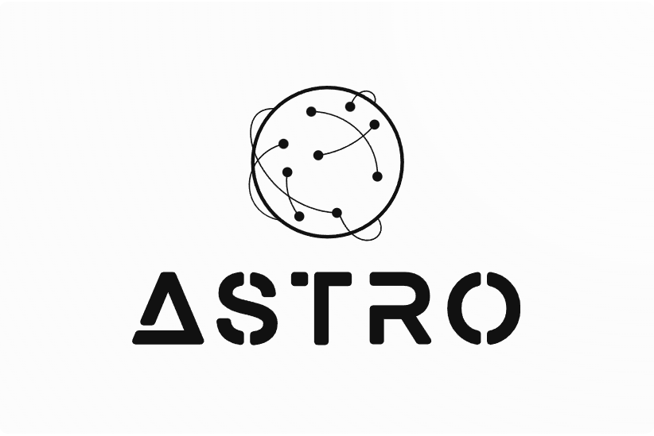
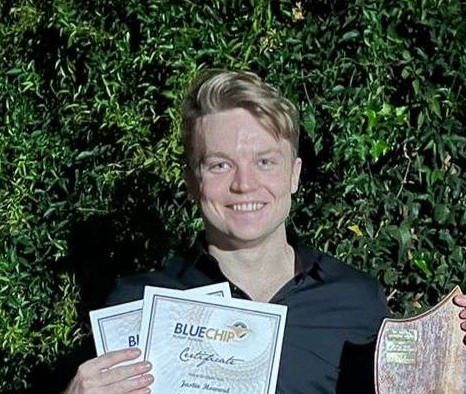
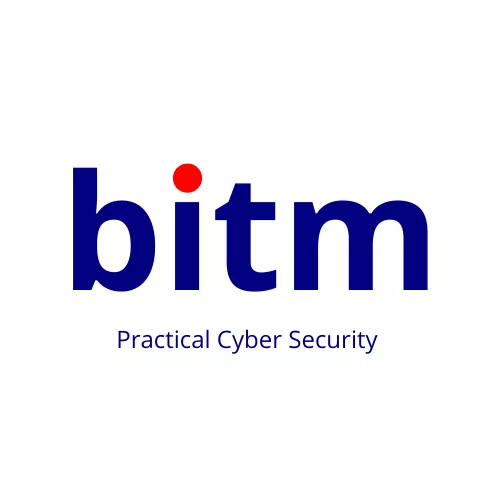



<h1 align='center'>CoVAR  </h1>

    
    
    
    
    
    

<h3 align="left">Languages and Tools:</h3>

            

## Table of Content
* [Project Description](#project-descritpion)
* [Demos](#demo)
* [Documentation](#documentation)
* [Team Profiles](#team-profiles)
* [Project Board](https://github.com/orgs/COS301-SE-2023/projects/27/views/1)

## Project Descritpion
The CoVAR project by BlueVision ITM aims to develop a comprehensive vulnerability assessment and reporting tool designed to consolidate and analyze data from various cybersecurity assessment tools. By integrating findings from multiple vulnerability scanners, COVAR will provide a unified view of an organization's security posture, enabling clients to identify and mitigate potential risks more efficiently.

## Demos
* [Demo 1 Video](https://drive.google.com/file/d/18-8LR9x710CWpvD0dDpWLcKnwXGHsy_M/view?usp=sharing)
* [Demo 2 Video](https://drive.google.com/file/d/1Dpynfe4pK_SkFPkS9EYfpClK6Z_cxYXn/view?usp=sharing)
* [Demo 3 Video](https://drive.google.com/file/d/1Njv7EX8lYqedBnqkF562axwaYqV2sQBU/view?usp=sharing)

## Documentation
* [Requirements and Design (SRS) Document](https://docs.google.com/document/d/1rhLhNdHQONaVFSU4WyOLPm6ZoKlxLMqk/edit?usp=sharing&ouid=112929114105055327648&rtpof=true&sd=true)
* [Architectural Structural Design](https://docs.google.com/document/d/1rhLhNdHQONaVFSU4WyOLPm6ZoKlxLMqk/edit?usp=sharing&ouid=112929114105055327648&rtpof=true&sd=true)
* [Coding and Testing Standards](https://docs.google.com/document/d/19x0yDaAYaYr555nFialOXTFLBrfKUHfo8NFclaq-4Zg/edit?usp=sharing)
* [Project Board](https://github.com/orgs/COS301-SE-2024/projects/94)
* [User Manual](https://docs.google.com/document/d/1H26oOpBHo4t9EL1G9kraeXB6f_Abepx8sn1_zJdNeCU/edit?usp=sharing)
* [Technical Installation](https://docs.google.com/document/d/1dU5z7HhWsoiKwqF611Anz3zIODVH_MwI2TRsUfeYXCE)

## Team Profiles
|  |  |  |  | |
|--------|--------|--------|-------|-------|
|    <strong> Jacques Malan      |    <strong> Alec Watson       |   <strong> Edward Harvey      |  <strong> Daniel Geerdink       |   <strong>Aren Repko       |

## Project Owner

## Contact Us

 astroteam.capstone@gmail.com

